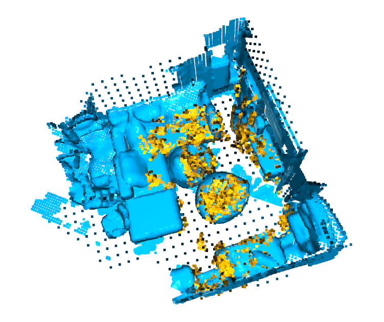
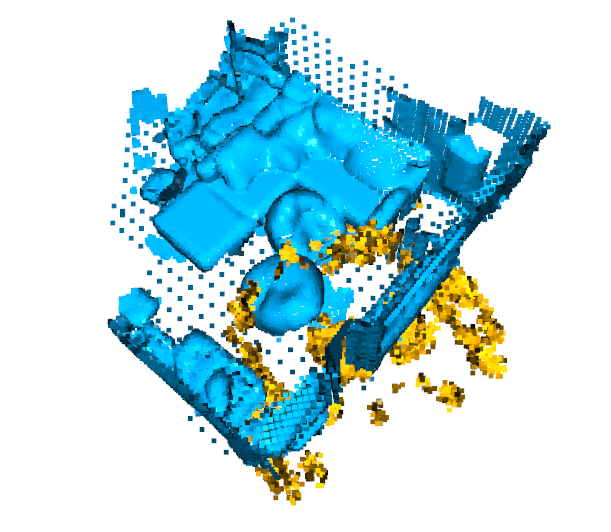

# Point Set Registration (point cloud matching)

В рамках задания мне необходимо было выполнить задачу point cloud matching.
 Необходимо было совместить облако точек одной из AR-сессий с целевым облаком точек этого же помещения.
 В процессе решения я использовал библиотеку open3d. 
 Ниже дам описание моего решения.  

## Исходные данные
Мне была дана целевая сцена, которая представляет из себя облако точек некоторого помещения в формате .fbx.
 Я вытащил точки из этого файла и конвертировал его в target.pcd. 
 Целевая сцена: 
 

 Также были даны результаты сканирования этого же помещения в ходе различных AR-сессий. Всего 10 AR-сессий. 

## Подготовка данных
Я проанализировал сканы AR-сессий - все они имеют "хвосты" из точек, которые представляют из себя шум. Кроме того, они все плюс-минус одинаковые, поэтому я решил использовать их все.
 1. Я достал из каждого файла точки и конвертировал его в формат _o3d.geometry.PointCloud_. Процедура _prepare_scan_ar()_. 
 2. Каждое облако я очистил от выбросов. _remove_outliers()_.
 3. Далее я взял scan1 как целевой, а для всех остальных сканов нашел матрицу трансформации относительно первого скана для того, чтобы совместить их. 
 Для совмещения использовал алгоритм _o3d.pipelines.registration.registration_icp()_. В цикле перебирал _threshold_. Максимальное значение _threshold_ 4 см, чтобы не получилось много шума. 
 К целевому облаку (scan1) добавлял только те точки, которые попали в _correspondence_set_. Таким образом, я сделал облако scan1 более плотным.
 Результат scan1:
 

 Видим, что много шумовых точек, висящих в воздухе и не несущих смысловой нагрузки. Удалим их с помощью _remove_outliers()_.
 Результат scan1 после очистки:
 

 Также я заметил, что scan1 (и все остальные сканы) "вывернуты наизнанку" относительно целевой сцены. Поэтому я инвертировал Z координату в scan1.
 Данные готовы можно мэтчить два облака точек. 

## Point cloud matching
### ICP registration 
Для совмещения облаков точек на первом этапе я использовал алгоритмы **point-to-point** и **point-to-plane**. Чтобы они сошлись, важно задать хорошее начальное приближение, иначе они не сходятся.
 Они оба застревают в локальном минимуме и в результате обалка точек сходятся плюс-минус как никак.
 В итоге я подобрал начальное приближение, чтобы они в результате сходились. 
 Посмотрим на взаимное расположение облаков до работы алгоритма:
   
 В ходе алгоритма выбирается перебирается значение _threshold_ и выбирается лучшее на основе значения _fitness_. Как вариант, в качестве показателя лучшего решения можно использовать _f1-меру_ от _fitness_ и _inlier_rmse_.
 Результат работы алгоритма:
 
 Видим, что облака сошлись. В среднем point-to-plane сходится в 2 раза быстрее, чем point-to-point.

### Global Registration
Минус point-to-point и point-to-plane алгоритмов в том, что они предполагают хорошее начальное расположение облаков относительно друг друга. 
 Попробуем использовать RANSAC для того, чтобы он совместил облака так, чтобы они оказались близко друг к другу, а затем с помощью point-to-point улучшим результат. 
 Для работы RANSAC для каждой точки извлекается 33-мерный вектор с помощью _o3d.pipelines.registration.compute_fpfh_feature_. 
 Общий алгоритм:
 1. Вокселизируем облака, чтобы уменьшить размерность и понизить вычислительные затраты.
 2. Извлекаем 33-мерный вектор для каждой точки. 
 3. Ищем матрицу трансформации, такую, чтобы облака оказались близко друг к другу с помощью _o3d.pipelines.registration.registration_ransac_based_on_feature_matching_.
 4. Применяем матрицу трансформации и улучшаем результат с помощью point-to-point. 
 
 Результат после применения матрицы трансформации:
 
 После применения point-to-point (не сошлось):
 

 По факту оказалось, что _o3d.pipelines.registration.registration_ransac_based_on_feature_matching_ работает далеко не всегда на данном примере.
 Это связано с тем, что очень мало плоских поверхностей в сцене источнике. 
 Возможно, нужно попытаться подобрать оптимальные параметры или использовать другой алгоритм.  